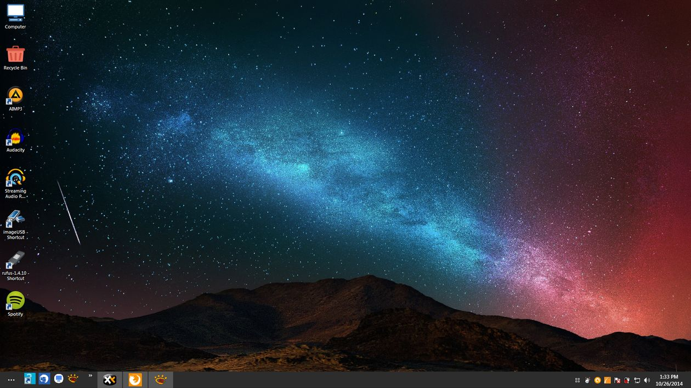
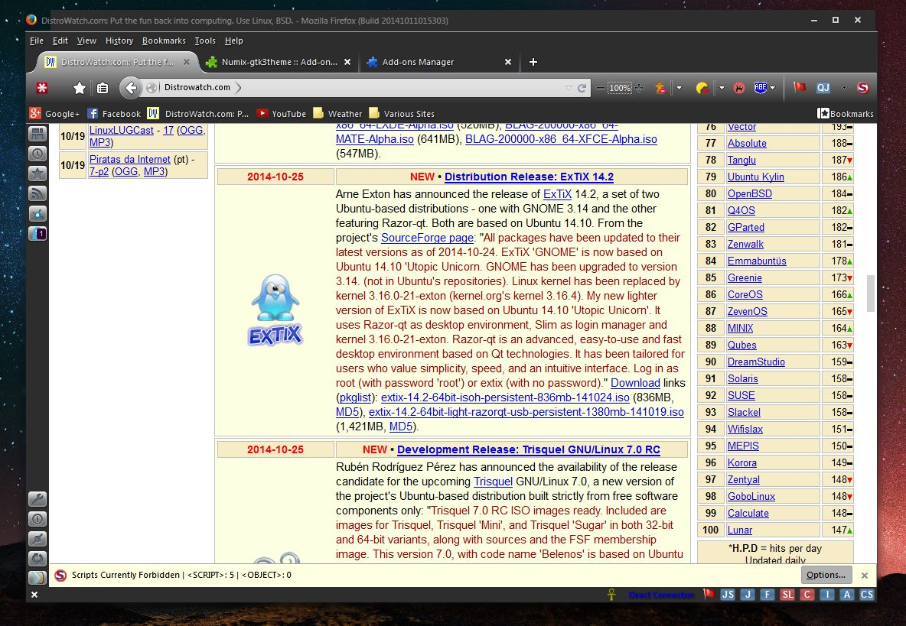
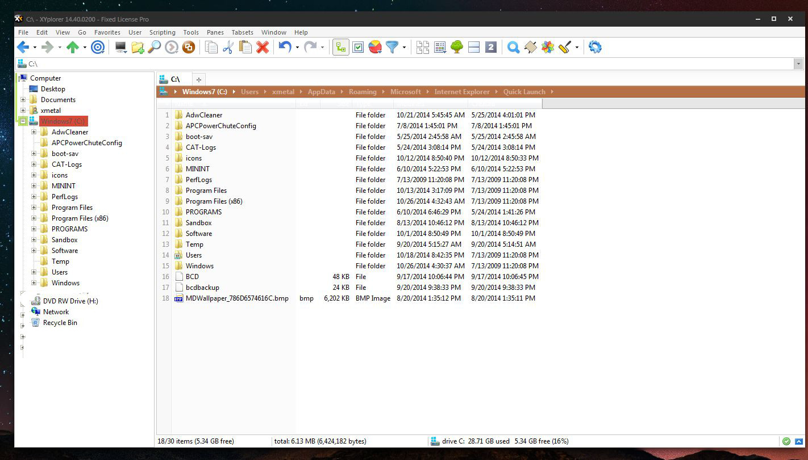
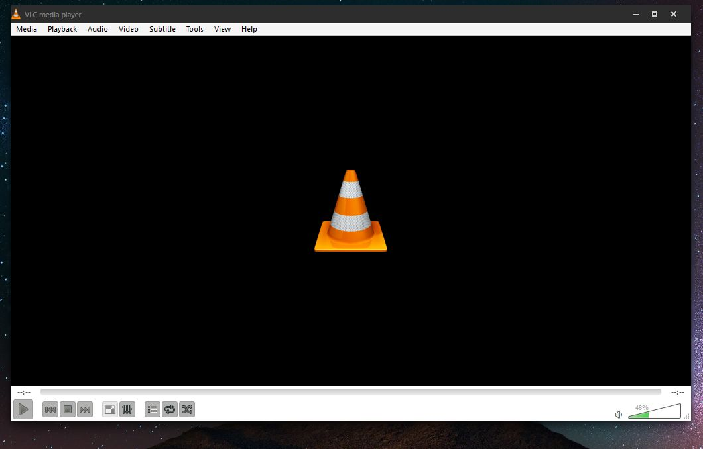
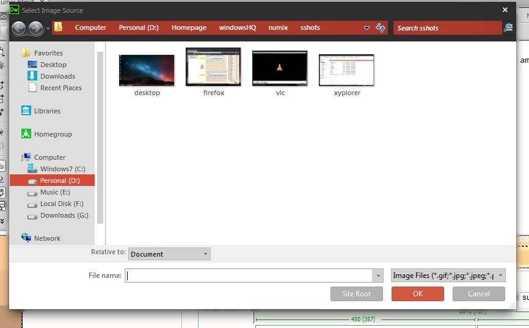

These are some screenshots of &quot;Numix on Windows 7&quot; ... There are a few things I am not sure about (I am not sure if i'd like to recommend
 it YET) but here is an idea of what it can look like.
      
      <table width="90%" border="1" align="center" cellpadding="8">
        <tr class="boldUnderline">
          <td width="450" class="boldUnderline">Desktop</td>
          <td width="450" class="boldUnderline">Firefox</td>
        </tr>
        <tr>
          <td></td>
          <td></td>
        </tr>
        <tr class="boldUnderline">
          <td class="boldUnderline">Xyplorer File Manager </td>
          <td class="boldUnderline">VLC </td>
        </tr>
        <tr>
          <td height="367"></td>
          <td></td>
        </tr>
        <tr>
          <td height="35" class="boldUnderline">Open Dialog Box </td>
          <td>&nbsp;</td>
        </tr>
        <tr>
          <td height="280"></td>
          <td>&nbsp;</td>
        </tr>
      </table>
      
&nbsp;

      
&nbsp;

      <!-- InstanceEndEditable -->
    

 
